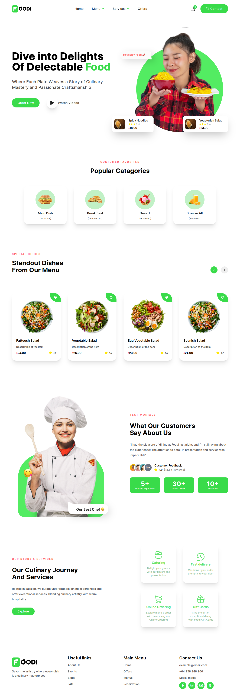

## Project title

Restaurant Website Template(Front-End) Designed with HTML,CSS & TAILWIND CSS

## Project Preview

## Build with

## Features

Responsive

## Installation

1. Node Preinstalled
2. `git clone https://github.com/ShejanMahamud/Restaurant-Website-Template`
3. Open file on vs code and open terminal `ctrl+j`
4. run `npm run build`

## Credits

>)

Copyright &copy; 2023 Shejan Mahamud

